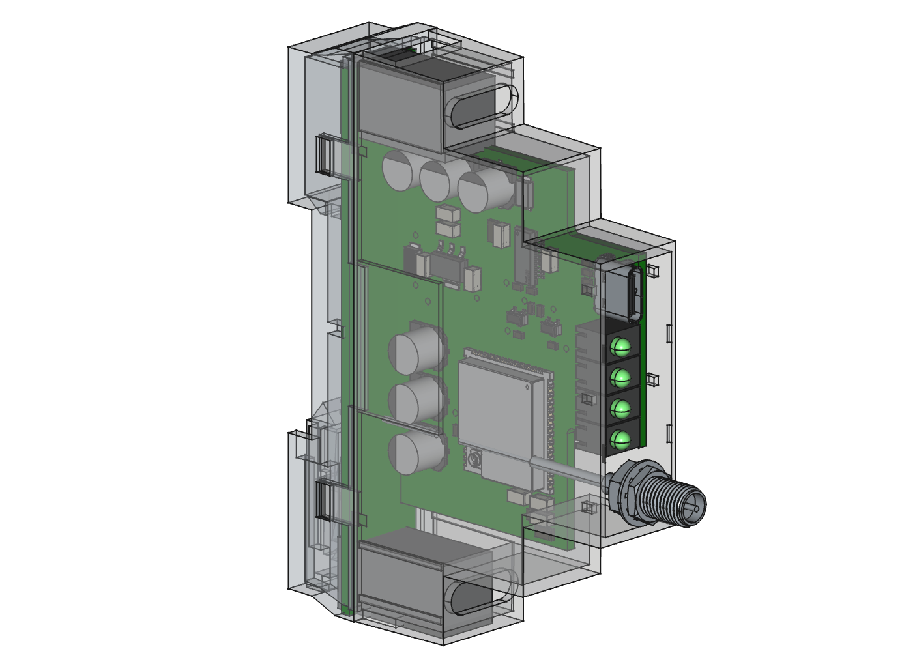
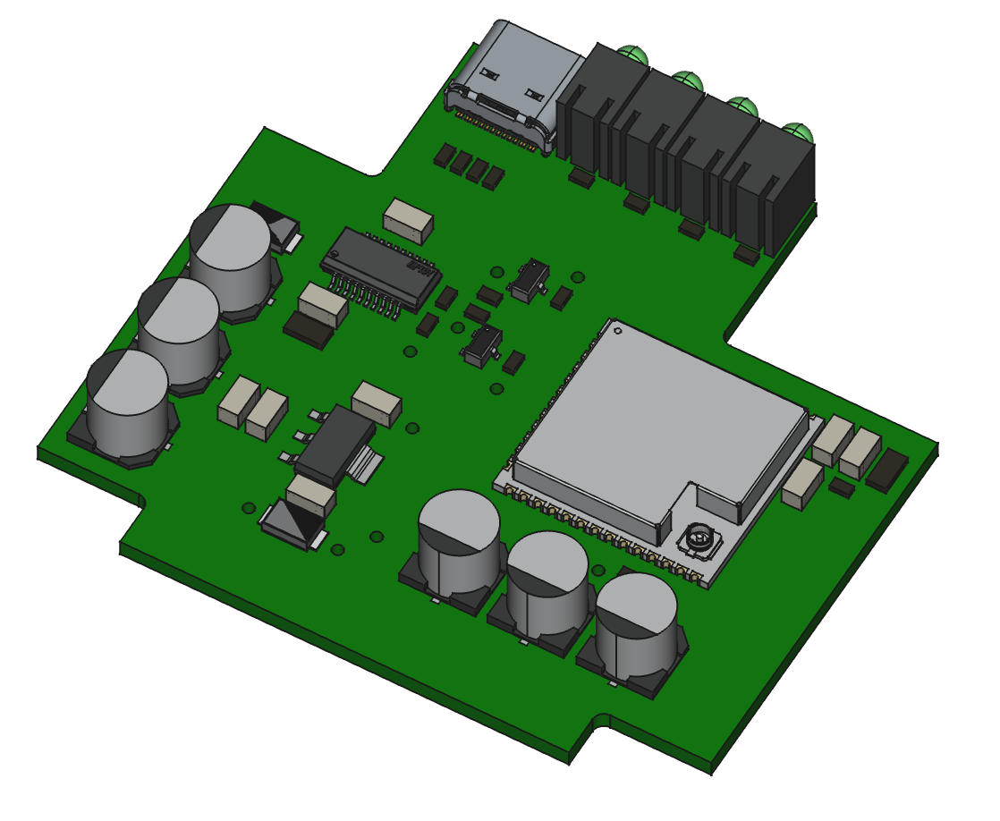

# B2500 Battery Control ESP32 Gateway

> [!CAUTION]
> This project is under heavy development. All hardware and code in the 'proto' branch is entirely untested. Once hardware has been tested additional branches and tags will be created.

> [!NOTE]
> There are licensing concerns regarding the original source files (see FAQ). Therefore only the design output is available here for now. 

## Introduction
This project documents the build of a Wifi to BLE gateway specifically to control B2500 type solar storage batteries through esphome. This heavily leans on the great esphome b2500 component [https://github.com/tomquist/esphome-b2500](https://github.com/tomquist/esphome-b2500). The code provided with this project is only to be seen as example code and was originally generated using the code generator by tomquist.

The gateway integrates an ESP32-S3 in a DIN-rail housing including some status LEDs, an external RP-SMA antenna connector, and 5V power inputs to be supplied by a DIN-rail power supply. Alternatively a USB-C port is provided for debug access and power. The circuit is based on the reference design for the ESP32-S3 including power regulator and reset circuit. 

## Assembly
> [!NOTE]  
> Pictures of the entire assembly will be added once hardware arrives.

The device consists of multiple sub-assemblies:

- Baseboard which contains most of the electronic circuits.
- Piggyback board which only contains two screw terminal blocks for 5V power. This board has a slot into which the baseboard is inserted and soldered in place.
- U.FL to RP-SMA internal antenna cable. Purchased from Amazon / AliExpress
- RP-SMA external antenna. Purchased from Amazon / AliExpress
- Kradex Z105 DIN rail enclosure, also sold under the "Wittko" brand.
- 3D printed front panel for enclosure (to be designed!)

## FAQ

**Q: Where are the source files?**

**A:** I quickly created this design in Altium using manufacturer provided symbols and footprints. The licensing implications are unclear to me. Rather than not sharing anything, I am sharing Gerbers and schematics that should allow recreating the hardware for anyone interested.

**Q: Why not KiCAD?**

**A:** Because I am much faster in Altium. The goal is to convert the original source code to KiCAD in the future, use only open-source hardware compatible libraries and re-upload.

**Q: Why using an 'import' statement in your code?**

**A:** I have two B2500 units that are each controlled from one gateway. This allows separation of common code from instance specific configuration.
